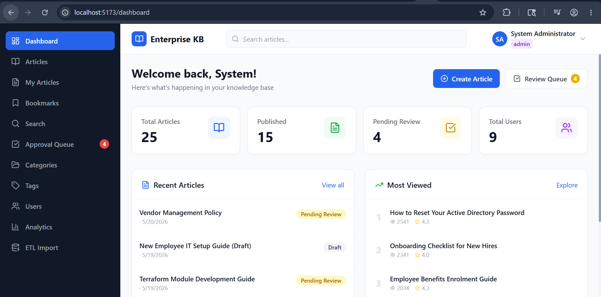
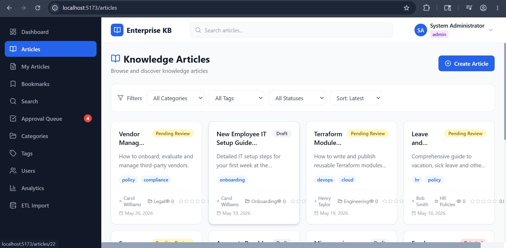
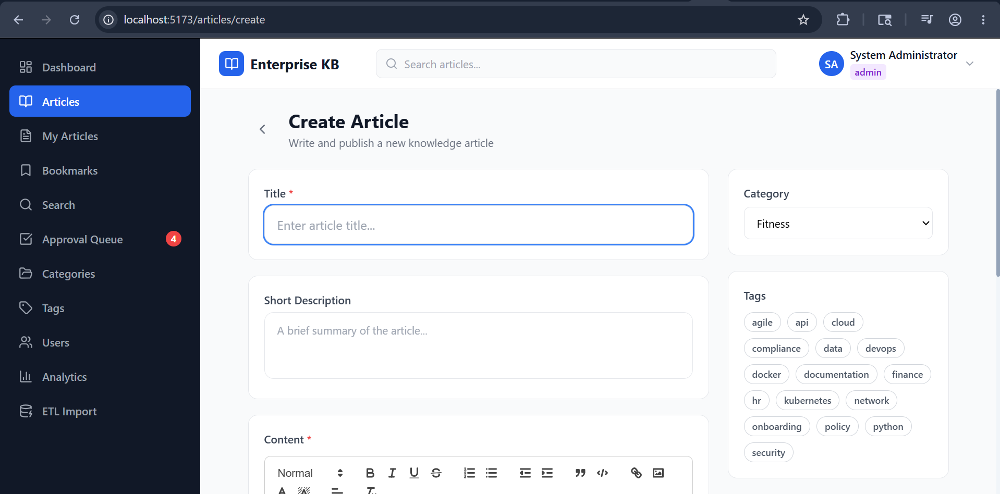
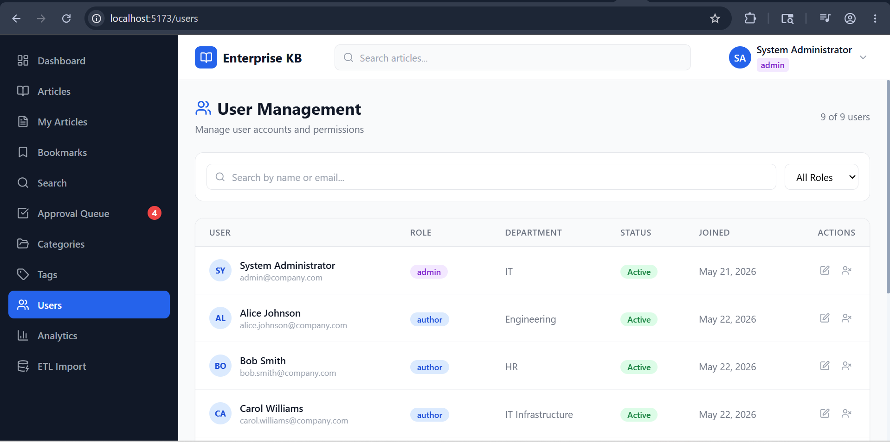
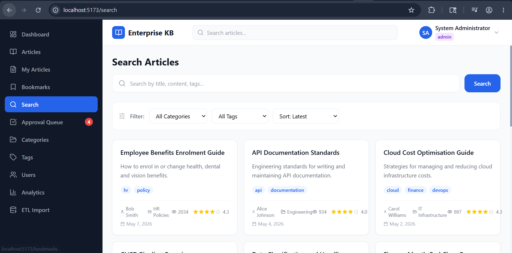
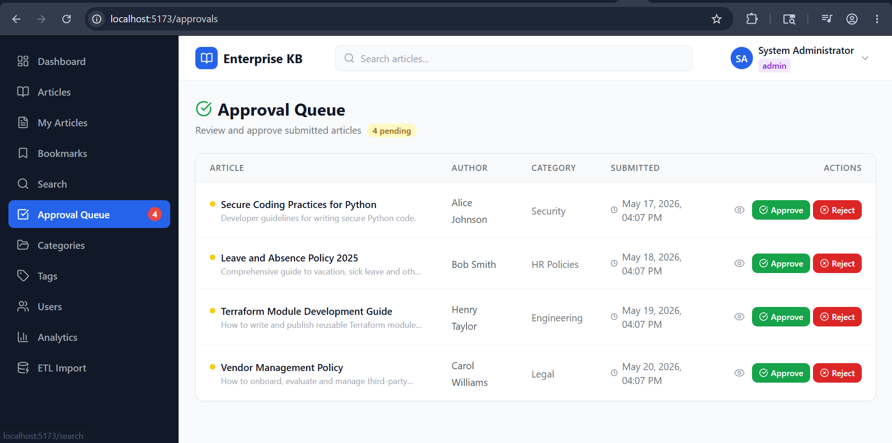
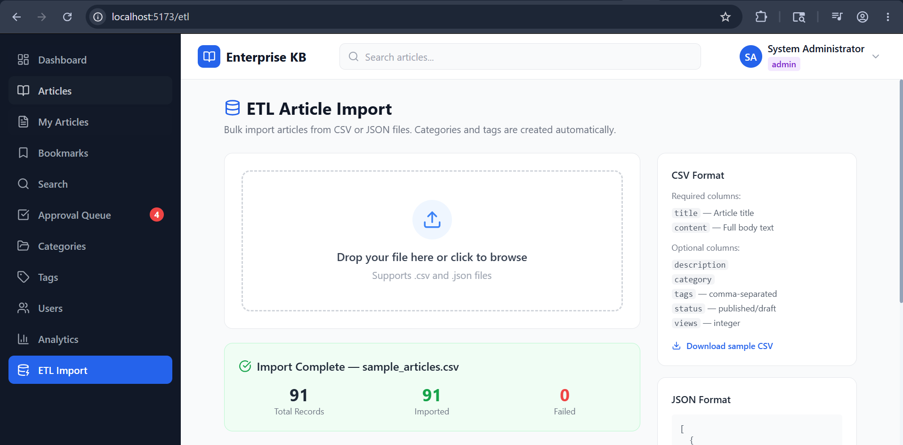

# Enterprise Knowledge Base

A full-stack knowledge management platform built with **FastAPI** and **React**. Supports article authoring with a rich text editor, role-based approval workflows, bulk ETL imports, and a comprehensive analytics dashboard.

---

## Screenshots

### Dashboard


The home screen shows at-a-glance KPIs — total articles, published count, pending reviews, and registered users — followed by a recent articles list and a most-viewed ranking. All counters are live from the database.

---

### Browse Articles


The articles listing page includes a filter bar with dropdowns for category, tag, status, and sort order. Each card shows the article title, author, status badge, view count, and average rating.

---

### Create / Edit Article


Authors write content in a Quill rich text editor with full formatting support. The right-hand sidebar exposes category selection, multi-tag picker, and publication status controls.

---

### User Management


Admins see every registered user in a paginated table with role badges (admin / author / reviewer / employee), department, join date, and active status. Inline role and status edits are supported.

---

### Search


Full-text search across titles, descriptions, and content. Results display star ratings, author name, category, and a snippet, making it easy to evaluate relevance before opening an article.

---

### Approval Queue


Reviewers see all articles awaiting approval in a dedicated queue. Each row offers one-click **Approve** and **Reject** buttons with an optional rejection-reason field. The sidebar badge updates in real time.

---

### ETL Bulk Import


Admins can drag-and-drop a CSV or JSON file to import hundreds of articles in one shot. The result panel shows total records, imported count, failed count, and per-row error details. A sample CSV template is available for download.

---

## Features

### Phase 1 — Core Knowledge Base
- JWT authentication with access tokens
- Role-based access control (admin · author · reviewer · employee)
- Article lifecycle: draft → pending approval → published / rejected → archived
- Rich text editor (Quill) for article creation and editing
- Category hierarchy with parent / child relationships
- Tag management
- Bookmarks per user
- Comments and 1–5 star ratings on articles
- File attachment uploads (PDF, DOCX, images, up to 10 MB)
- Full-text search with category and tag filters
- Approval queue with complete approval history

### Phase 2 — ETL Pipeline & Enhanced Analytics
- **ETL Import** — bulk article ingestion from CSV or JSON; automatic category and tag resolution; per-row error reporting; import job history with status tracking
- **Article creation trends** — line chart of articles created per month (last 12 months)
- **Author activity report** — table of article count, total views, and average rating per author
- **Engagement stats** — aggregate totals for comments, ratings, and bookmarks plus overall average rating
- Existing analytics extended: category bar chart, top-10 most-viewed horizontal bar chart, top search terms table

---

## Tech Stack

| Layer | Technology |
|---|---|
| Backend framework | FastAPI 0.110 |
| ORM | SQLAlchemy 2.0 |
| Database | PostgreSQL (pg8000 driver) |
| Authentication | python-jose (JWT) · passlib + bcrypt 4.0.1 |
| File parsing (ETL) | Python built-in `csv` / `json` |
| Frontend framework | React 18 + Vite |
| Styling | Tailwind CSS |
| Data fetching | @tanstack/react-query |
| Rich text editor | Quill (react-quill) |
| Charts | Recharts |
| Icons | Lucide React |

---

## Project Structure

```
Enterprise-Knowledge-Base/
├── backend/
│   ├── app/
│   │   ├── core/
│   │   │   ├── security.py       # JWT + password hashing
│   │   │   └── seed.py           # Demo data seeded on first startup
│   │   ├── models/               # SQLAlchemy ORM models
│   │   ├── routers/              # FastAPI routers (one per domain)
│   │   │   ├── analytics.py
│   │   │   ├── etl.py
│   │   │   └── ...
│   │   ├── schemas/              # Pydantic request/response schemas
│   │   ├── database.py           # Engine + session factory
│   │   ├── config.py             # Settings (env vars)
│   │   └── main.py               # App factory + lifespan
│   ├── data/
│   │   └── sample_articles.csv   # 100-row sample for ETL demo
│   ├── uploads/                  # Runtime file attachment storage
│   ├── requirements.txt
│   └── run.py                    # uvicorn entry point (port 8080)
├── frontend/
│   ├── src/
│   │   ├── components/           # Shared UI components
│   │   ├── context/              # AuthContext
│   │   ├── pages/                # One folder per route
│   │   │   ├── analytics/
│   │   │   ├── etl/
│   │   │   └── ...
│   │   ├── services/             # Axios API wrappers
│   │   ├── App.jsx
│   │   └── main.jsx
│   ├── .env
│   └── package.json
├── images/                       # Application screenshots
└── README.md
```

---

## Prerequisites

- Python 3.10+
- Node.js 18+
- PostgreSQL 14+

---

## Setup & Run

### 1. Create the database

```sql
CREATE DATABASE knowledge_base_db;
```

### 2. Backend

```bash
cd backend

# Create and activate virtual environment
python -m venv venv
venv\Scripts\activate        # Windows
# source venv/bin/activate   # macOS / Linux

# Install dependencies
pip install -r requirements.txt

# Pin bcrypt to avoid passlib incompatibility
pip install "bcrypt==4.0.1"
```

Create `backend/.env`:

```env
DATABASE_URL=postgresql+pg8000://postgres:<your_password>@localhost:5432/knowledge_base_db
SECRET_KEY=your-secret-key-here-change-in-production-use-32-chars-min
ALGORITHM=HS256
ACCESS_TOKEN_EXPIRE_MINUTES=30
UPLOAD_DIR=uploads
```

Start the backend:

```bash
python run.py
# API available at http://localhost:8080
# Interactive docs at http://localhost:8080/docs
```

### 3. Frontend

```bash
cd frontend
npm install
```

Create `frontend/.env`:

```env
VITE_API_BASE_URL=http://localhost:8080
```

Start the dev server:

```bash
npm run dev
# App available at http://localhost:5173
```

### 4. Production build (optional)

```bash
cd frontend
npm run build
# Built files land in frontend/dist/
# FastAPI automatically serves them — open http://localhost:8080
```

---

## Demo Data

On first startup the backend seeds the database automatically (only runs when no articles exist yet). After seeding you will have:

- **25 articles** — 15 published, 4 pending approval, 3 draft, 2 rejected, 1 archived
- **9 users** — 1 admin + 8 demo users across all roles
- **8 categories**, **16 tags**
- Ratings, comments, bookmarks, and approval history records

### Default Admin

| Field | Value |
|---|---|
| Email | admin@company.com |
| Password | Admin@123 |

### Seeded Demo Users

All demo users share the password **`Password@123`**.

| Name | Email | Role | Department |
|---|---|---|---|
| Alice Johnson | alice.johnson@company.com | author | Engineering |
| Bob Smith | bob.smith@company.com | author | HR |
| Carol Williams | carol.williams@company.com | author | IT Infrastructure |
| David Brown | david.brown@company.com | reviewer | Security |
| Emma Davis | emma.davis@company.com | reviewer | Finance |
| Frank Wilson | frank.wilson@company.com | employee | Product |
| Grace Lee | grace.lee@company.com | employee | Legal |
| Henry Taylor | henry.taylor@company.com | author | Engineering |

---

## User Roles

| Role | Capabilities |
|---|---|
| **admin** | Full access: user management, categories, analytics, ETL import, approve/reject articles |
| **author** | Create, edit, and submit own articles for review |
| **reviewer** | Approve or reject articles in the approval queue |
| **employee** | Read published articles, search, bookmark, comment, and rate |

---

## Article Lifecycle

```
draft  ──►  pending_approval  ──►  published
                │                      │
                └──►  rejected          └──►  archived
```

---

## Application Routes

| Path | Access | Description |
|---|---|---|
| `/dashboard` | All | KPI cards and recent articles |
| `/articles` | All | Browse and filter all published articles |
| `/articles/create` | author, admin | New article form |
| `/articles/:id` | All | Article detail with comments and ratings |
| `/articles/:id/edit` | author (own), admin | Edit article |
| `/my-articles` | author, admin | Personal article list |
| `/approvals` | reviewer, admin | Approval queue |
| `/search` | All | Full-text search |
| `/categories` | admin | Category management |
| `/tags` | All | Tag browser |
| `/users` | admin | User management |
| `/analytics` | admin | Charts and stats |
| `/etl` | admin | Bulk CSV / JSON import |
| `/bookmarks` | All | Saved articles |
| `/profile` | All | Edit own profile |

---

## API Endpoints

### Auth
| Method | Path | Description |
|---|---|---|
| POST | `/api/auth/login` | OAuth2 form login, returns JWT |
| POST | `/api/auth/login/json` | JSON body login |
| POST | `/api/auth/register` | Register new user |
| GET | `/api/auth/me` | Current user profile |

### Articles
| Method | Path | Description |
|---|---|---|
| GET | `/api/articles` | List articles (filters: category, tag, status, search) |
| POST | `/api/articles` | Create article |
| GET | `/api/articles/{id}` | Article detail (increments view count) |
| PUT | `/api/articles/{id}` | Update article |
| DELETE | `/api/articles/{id}` | Delete article |
| POST | `/api/articles/{id}/submit` | Submit draft for review |
| GET | `/api/articles/my` | Current user's articles |

### Approvals
| Method | Path | Description |
|---|---|---|
| GET | `/api/approvals/pending` | List pending articles |
| POST | `/api/approvals/{id}/approve` | Approve article |
| POST | `/api/approvals/{id}/reject` | Reject with reason |
| GET | `/api/approvals/{id}/history` | Approval history for an article |

### Categories & Tags
| Method | Path | Description |
|---|---|---|
| GET | `/api/categories` | All categories |
| POST | `/api/categories` | Create category (admin) |
| PUT | `/api/categories/{id}` | Update category (admin) |
| DELETE | `/api/categories/{id}` | Delete category (admin) |
| GET | `/api/tags` | All tags |
| POST | `/api/tags` | Create tag |

### Search
| Method | Path | Description |
|---|---|---|
| GET | `/api/search?q=` | Full-text search across articles |

### Analytics
| Method | Path | Description |
|---|---|---|
| GET | `/api/analytics/dashboard` | Core KPI metrics |
| GET | `/api/analytics/popular` | Top articles by view count |
| GET | `/api/analytics/category-stats` | Article counts per category |
| GET | `/api/analytics/search-trends` | Top search queries |
| GET | `/api/analytics/article-trends` | Monthly article creation (last 12 months) |
| GET | `/api/analytics/author-activity` | Per-author article count, views, avg rating |
| GET | `/api/analytics/engagement-stats` | Totals for comments, ratings, bookmarks |

### ETL Import
| Method | Path | Description |
|---|---|---|
| POST | `/api/etl/import` | Upload CSV or JSON file; returns import summary |
| GET | `/api/etl/jobs` | List all import jobs (admin) |
| GET | `/api/etl/jobs/{id}` | Import job detail |
| GET | `/api/etl/sample` | Download sample CSV template |

### Files
| Method | Path | Description |
|---|---|---|
| POST | `/api/files/upload` | Upload file attachment |
| GET | `/uploads/{filename}` | Serve uploaded file (static) |

---

## ETL CSV Format

Download the sample template from **ETL Import → Download Sample CSV**.

Required columns: `title`, `content`  
Optional columns: `description`, `category`, `tags` (comma-separated), `status`, `views`

```csv
title,description,content,category,tags,status,views
VPN Setup Guide,How to configure VPN,Full content here...,IT Infrastructure,"vpn,security",published,320
```

- `category` — matched to an existing category by name; created automatically if absent
- `tags` — comma-separated; each tag is matched or created
- `status` — defaults to `published` if omitted or unrecognised
- Rows missing `title` or `content` are skipped and reported in the error detail

---

## Interactive API Docs

FastAPI auto-generates documentation at:

- **Swagger UI**: `http://localhost:8080/docs`
- **ReDoc**: `http://localhost:8080/redoc`
