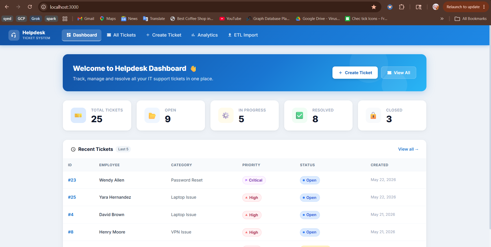
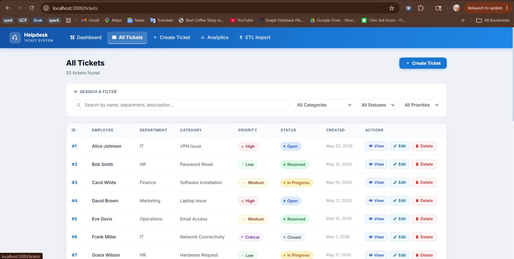
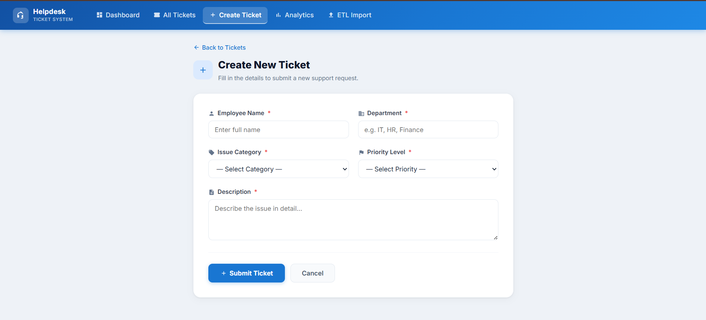
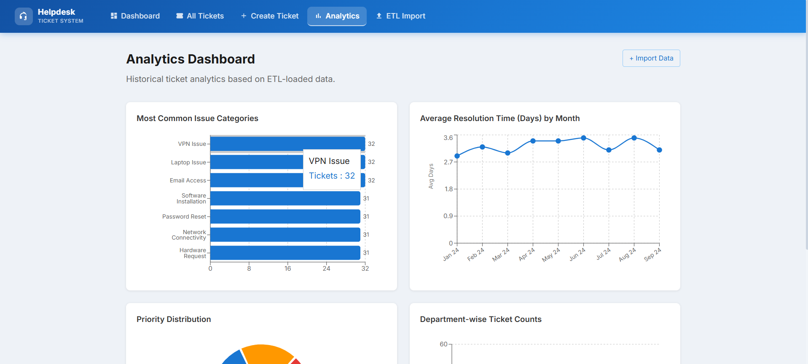
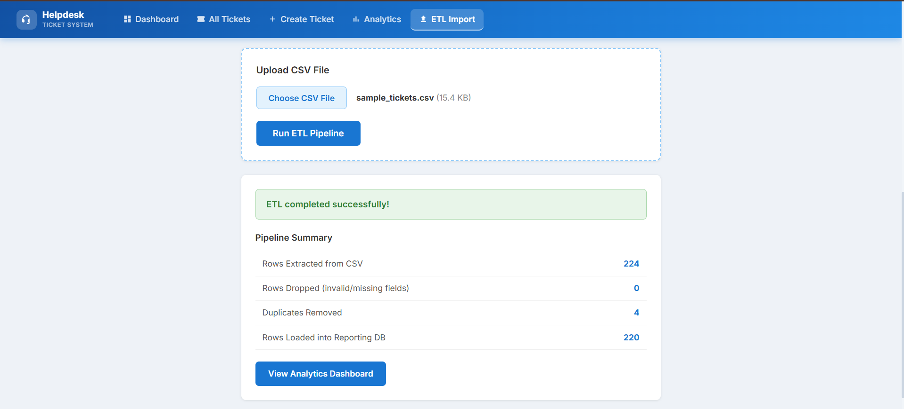

# Helpdesk Ticket Management System

A full-stack web application for managing IT helpdesk tickets with an ETL pipeline for historical data analysis and an analytics dashboard. Built with FastAPI (Python) on the backend and React on the frontend.

---

## Screenshots

### Dashboard


### All Tickets


### Create New Ticket


### Analytics Dashboard


### ETL Import


---

## Tech Stack

| Layer    | Technology                                        |
|----------|---------------------------------------------------|
| Backend  | Python 3.8+, FastAPI, SQLAlchemy, Pandas          |
| Database | SQLite (`helpdesk.db`)                            |
| Frontend | React 18, React Router v6, Axios, Recharts        |
| Styling  | Inline CSS (no external UI library)               |

---

## Project Structure

```
Helpdesk-Ticket-Management-System/
├── backend/
│   ├── main.py                  # FastAPI app entry point
│   ├── database.py              # SQLAlchemy engine & session
│   ├── models.py                # ORM models (Ticket, HistoricalTicket)
│   ├── schemas.py               # Pydantic schemas
│   ├── crud.py                  # Database CRUD operations
│   ├── requirements.txt
│   ├── routers/
│   │   ├── tickets.py           # Ticket CRUD API routes
│   │   ├── analytics.py         # Analytics API routes (Phase 2)
│   │   └── etl.py               # ETL upload API routes (Phase 2)
│   ├── etl/
│   │   ├── __init__.py
│   │   └── pipeline.py          # ETL logic: extract, transform, deduplicate, load
│   └── data/
│       └── sample_tickets.csv   # 200+ sample historical tickets
├── frontend/
│   ├── public/
│   │   └── index.html
│   ├── src/
│   │   ├── components/
│   │   │   ├── Navbar.jsx
│   │   │   ├── TicketCard.jsx
│   │   │   ├── StatusBadge.jsx
│   │   │   └── PriorityBadge.jsx
│   │   ├── pages/
│   │   │   ├── Dashboard.jsx
│   │   │   ├── CreateTicket.jsx
│   │   │   ├── TicketList.jsx
│   │   │   ├── TicketDetail.jsx
│   │   │   ├── EditTicket.jsx
│   │   │   ├── Analytics.jsx    # Phase 2 — chart dashboard
│   │   │   └── ETLImport.jsx    # Phase 2 — CSV upload UI
│   │   ├── services/
│   │   │   ├── ticketService.js
│   │   │   ├── analyticsService.js  # Phase 2
│   │   │   └── etlService.js        # Phase 2
│   │   ├── api.js
│   │   ├── App.js
│   │   └── index.js
│   └── package.json
├── images/                      # Project screenshots
└── README.md
```

---

## Setup Instructions

### Backend Setup

1. Navigate to the backend directory:
   ```bash
   cd backend
   ```

2. (Recommended) Create and activate a virtual environment:
   ```bash
   python -m venv venv
   # Windows:
   venv\Scripts\activate
   # macOS/Linux:
   source venv/bin/activate
   ```

3. Install dependencies:
   ```bash
   pip install -r requirements.txt
   ```

4. Start the FastAPI server:
   ```bash
   uvicorn main:app --reload --host 0.0.0.0 --port 8002
   ```

5. The API will be available at: `http://localhost:8002`
6. Interactive API docs (Swagger UI): `http://localhost:8002/docs`

> The database file (`helpdesk.db`) and both tables (`tickets`, `historical_tickets`) are created automatically on first startup.

---

### Frontend Setup

1. Navigate to the frontend directory:
   ```bash
   cd frontend
   ```

2. Install dependencies:
   ```bash
   npm install
   ```

3. Start the React development server:
   ```bash
   npm start
   ```

4. The app will open at: `http://localhost:3000`

---

## Phase 1 — Ticket Management

### Features

- **Dashboard** — Stat cards (Total, Open, In Progress, Resolved) and a recent 5 tickets table with quick navigation
- **Create Ticket** — Form with validation for all required fields; auto-redirects on success
- **All Tickets** — Full table with live keyword search and dropdowns to filter by category, status, and priority
- **Ticket Detail** — Read-only view of all ticket fields with color-coded status and priority badges
- **Edit Ticket** — Pre-filled form to update any field, including status and resolution notes
- **Delete Ticket** — Confirmation modal before permanent deletion

### API Endpoints

| Method | Endpoint        | Description                          |
|--------|-----------------|--------------------------------------|
| GET    | `/`             | Health check                         |
| GET    | `/tickets`      | Get all tickets (`skip`, `limit`)    |
| GET    | `/tickets/{id}` | Get a single ticket by ID            |
| POST   | `/tickets`      | Create a new ticket (returns 201)    |
| PUT    | `/tickets/{id}` | Update an existing ticket            |
| DELETE | `/tickets/{id}` | Delete a ticket                      |
| GET    | `/search`       | Search and filter tickets            |

#### Search / Filter Parameters (`GET /search`)

| Parameter  | Type   | Description                              |
|------------|--------|------------------------------------------|
| `keyword`  | string | Search across name, department, description |
| `category` | string | Filter by issue category                 |
| `status`   | string | Filter by status                         |
| `priority` | string | Filter by priority                       |

### Database Schema — `tickets` Table

| Column           | Type     | Constraints                    |
|------------------|----------|--------------------------------|
| ticket_id        | INTEGER  | PRIMARY KEY, AUTOINCREMENT     |
| employee_name    | VARCHAR  | NOT NULL                       |
| department       | VARCHAR  | NOT NULL                       |
| issue_category   | VARCHAR  | NOT NULL                       |
| description      | TEXT     | NOT NULL                       |
| priority         | VARCHAR  | NOT NULL                       |
| status           | VARCHAR  | DEFAULT `'Open'`               |
| resolution_notes | TEXT     | NULLABLE                       |
| created_at       | DATETIME | DEFAULT current UTC timestamp  |

---

## Phase 2 — ETL Pipeline & Analytics

### Overview

Phase 2 extends the system with a full ETL pipeline for importing historical ticket data and an analytics dashboard with four interactive charts.

### ETL Workflow

1. **Extract** — Upload a CSV file via the ETL Import page
2. **Transform** — Normalize categories, priorities, and statuses (handles messy/variant values automatically)
3. **Deduplicate** — Remove duplicate rows with the same employee + category + date
4. **Load** — Write the cleaned data into the `historical_tickets` reporting table

#### How to Run the ETL

1. Go to **ETL Import** in the navbar
2. Click **Choose CSV File** and select a CSV (use `backend/data/sample_tickets.csv` to try it out)
3. Click **Run ETL Pipeline**
4. Review the pipeline summary (rows extracted, dropped, deduplicated, loaded)
5. Click **View Analytics Dashboard** to see the charts

#### CSV Format

| Column          | Required | Accepted Values / Notes                                                |
|-----------------|----------|------------------------------------------------------------------------|
| `employee_name` | Yes      | Full name, e.g. `"Alice Johnson"`                                      |
| `department`    | Yes      | IT, HR, Finance, Marketing, Operations                                 |
| `issue_category`| Yes      | VPN Issue, Password Reset, Software Installation, Laptop Issue, Email Access, Network Connectivity, Hardware Request — or common variations |
| `status`        | Yes      | Open, In Progress, Resolved, Closed — or variations like `pending`, `wip`, `done`, `fixed` |
| `priority`      | Yes      | Low, Medium, High, Critical — or variations like `normal`, `urgent`, `h` |
| `created_date`  | Yes      | `YYYY-MM-DD` or `MM/DD/YYYY`                                           |
| `resolved_date` | No       | Leave blank for Open / In Progress tickets                             |

> The pipeline automatically normalizes messy values and removes duplicates. A sample dataset of 200+ rows is included at `backend/data/sample_tickets.csv`.

### Analytics Dashboard

After running the ETL import, the Analytics page displays four charts:

| Chart | Type | Shows |
|---|---|---|
| Most Common Issue Categories | Horizontal bar chart | Ticket count per issue category, sorted descending |
| Average Resolution Time by Month | Line chart | Monthly average days to resolve tickets |
| Priority Distribution | Donut pie chart | Proportion of tickets by priority level |
| Department-wise Ticket Counts | Vertical bar chart | Total tickets submitted per department |

### Analytics API Endpoints

| Method | Endpoint                          | Description                              |
|--------|-----------------------------------|------------------------------------------|
| GET    | `/analytics/issue-categories`     | Ticket count grouped by issue category   |
| GET    | `/analytics/resolution-trends`    | Monthly average resolution days          |
| GET    | `/analytics/priority-distribution`| Ticket count grouped by priority         |
| GET    | `/analytics/department-tickets`   | Ticket count grouped by department       |
| GET    | `/analytics/summary`              | Total count of rows in reporting table   |
| POST   | `/etl/upload`                     | Upload a CSV and run the ETL pipeline    |
| GET    | `/etl/status`                     | Count of records in `historical_tickets` |

### Database Schema — `historical_tickets` Table

| Column          | Type    | Constraints                                      |
|-----------------|---------|--------------------------------------------------|
| id              | INTEGER | PRIMARY KEY, AUTOINCREMENT                       |
| employee_name   | VARCHAR | NOT NULL                                         |
| department      | VARCHAR | NOT NULL                                         |
| issue_category  | VARCHAR | NOT NULL                                         |
| status          | VARCHAR | NOT NULL                                         |
| priority        | VARCHAR | NOT NULL                                         |
| created_date    | DATE    | NULLABLE                                         |
| resolved_date   | DATE    | NULLABLE — blank for unresolved tickets          |
| resolution_days | FLOAT   | NULLABLE — auto-computed from created/resolved dates |

> This table is the **reporting database** — it is separate from the operational `tickets` table and is fully replaced on each ETL run (idempotent).

---

## Reference Data

### Issue Categories

- VPN Issue
- Password Reset
- Software Installation
- Laptop Issue
- Email Access
- Network Connectivity
- Hardware Request

### Priority Levels

| Priority | Badge Color |
|----------|-------------|
| Low      | Green       |
| Medium   | Orange      |
| High     | Red         |
| Critical | Purple      |

### Ticket Statuses

| Status      | Badge Color |
|-------------|-------------|
| Open        | Blue        |
| In Progress | Yellow      |
| Resolved    | Green       |
| Closed      | Gray        |
