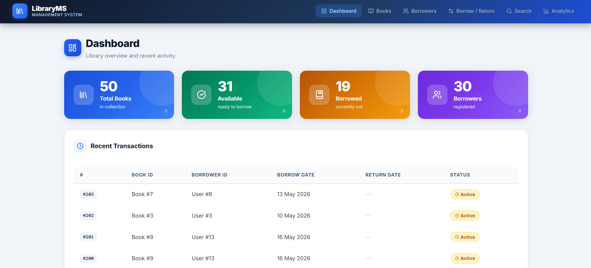
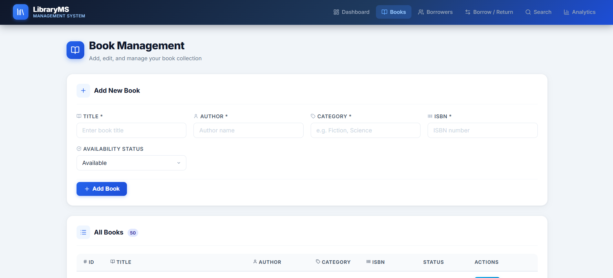
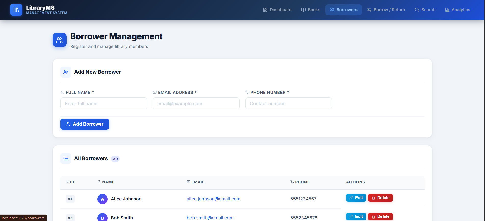
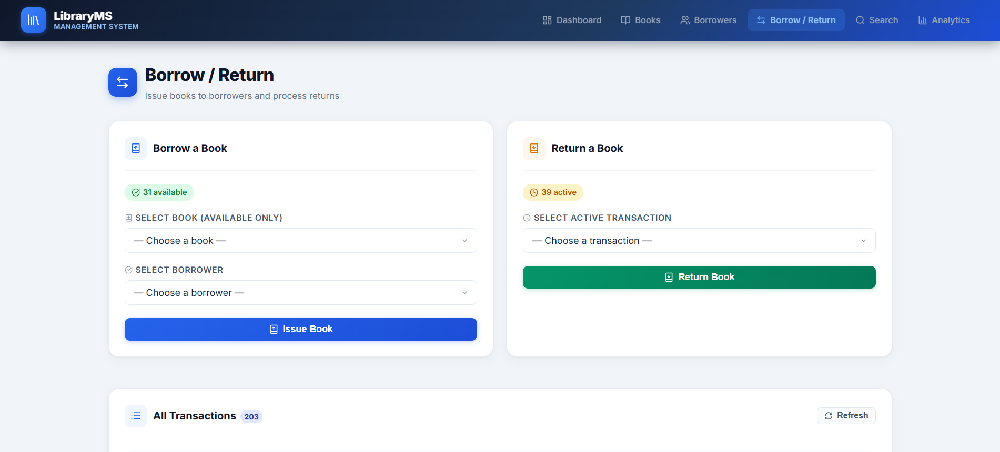
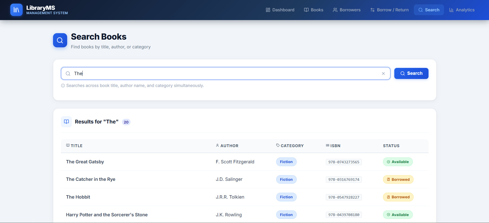
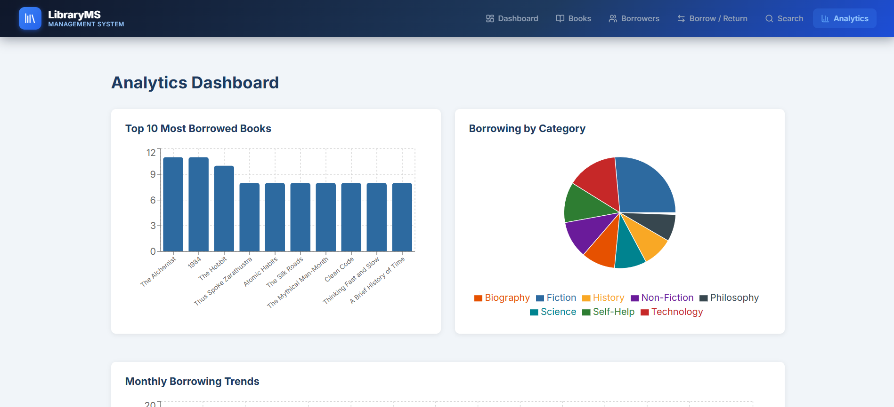
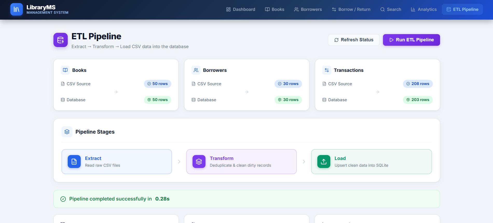
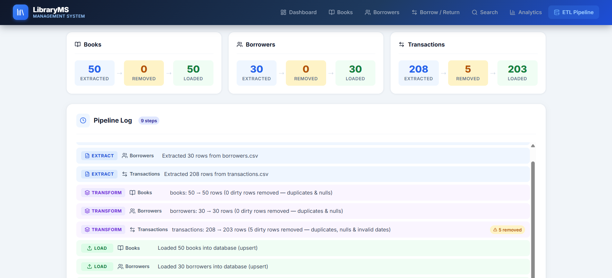

# Library Management System

A full-stack Library Management System built with **FastAPI** and **React**, featuring CRUD operations for books and borrowers, transaction tracking, a keyword search engine, and a Phase 2 ETL pipeline with an analytics dashboard.

**Stack:** Python · FastAPI · SQLAlchemy · SQLite · React · Vite · Recharts · Pandas · Axios

---

## Screenshots

### Dashboard

> Live stat cards (Total Books, Available, Borrowed, Borrowers) and a recent-transactions table.

### Book Management

> Add, edit, and delete books. Availability status badge (Available / Borrowed) on every record.

### Borrower Management

> Register and manage library members with name, email, and phone. Inline edit and delete with form validation.

### Borrow / Return

> Two-panel form — issue a book to a borrower, or return an active transaction. Full transaction history table below.

### Search Books

> Keyword search across title, author, and category with instant results table.

### Analytics Dashboard *(Phase 2)*

> Bar chart (Top 10 most borrowed books), Pie chart (borrowing by category), Line chart (monthly trends), and an Overdue Transactions table.

### ETL Pipeline *(Phase 2)*

> Status cards showing CSV source row counts vs. database row counts for Books, Borrowers, and Transactions. Pipeline stage visual (Extract → Transform → Load) and a success banner showing completion time after running.


> Per-entity summary cards (Extracted / Removed / Loaded counts) and a color-coded step-by-step Pipeline Log — blue for Extract, purple for Transform, green for Load — with inline "removed" chips highlighting dirty rows cleaned during transform.

---

## Features

### Phase 1 — Core Library Management
- **Dashboard** — real-time stats: total books, available, borrowed, total borrowers; last 5 transactions
- **Book Management** — full CRUD (add, edit, delete, list); availability status tracking
- **Borrower Management** — full CRUD; email format validation; unique email enforcement
- **Borrow / Return** — issue books to registered borrowers; one-click return; prevents double-borrowing
- **Search** — case-insensitive keyword search across title, author, and category
- **Form Validation** — client-side required-field and format checks on all forms

### Phase 2 — ETL Pipeline & Analytics
- **ETL Pipeline UI** — browser-triggered Extract → Transform → Load pipeline with live status cards, pipeline stage visual, success/error banner, per-entity summary (Extracted / Removed / Loaded), and a color-coded step-by-step log
- **ETL Status** — real-time comparison of CSV source row counts vs. current database row counts for Books, Borrowers, and Transactions before running
- **Dirty Data Cleaning** — Transform phase detects and removes duplicate records, null required fields, and invalid dates; removed rows are flagged inline in the pipeline log
- **Most Borrowed Books** — bar chart of top 10 titles ranked by borrow count
- **Category Analytics** — pie chart showing borrowing distribution across 7 genres
- **Monthly Trends** — line chart of borrow volume spanning Jan 2024 – May 2026
- **Overdue Analysis** — table of all unreturned books past their 14-day due date with days-overdue counter

---

## Tech Stack

### Backend
| Component | Technology |
|-----------|------------|
| Language | Python 3.10+ |
| Framework | FastAPI 0.115+ |
| ORM | SQLAlchemy 2.0+ |
| Database | SQLite (file-based) |
| Validation | Pydantic 2.9+ |
| ETL | Pandas 2.0+ |
| Server | Uvicorn |

### Frontend
| Component | Technology |
|-----------|------------|
| Framework | React 18 |
| Build Tool | Vite 5 |
| Routing | React Router DOM 7 |
| HTTP Client | Axios |
| Charts | Recharts |

---

## Project Structure

```
Library-Management-System/
├── data/
│   ├── books.csv              # 50 book records across 7 categories
│   ├── borrowers.csv          # 30 borrower records
│   └── transactions.csv       # 200+ transaction records (includes dirty data)
├── images/
│   ├── dashboard.png
│   ├── book-management.png
│   ├── borrower-management.png
│   ├── borrow-return-page.png
│   ├── search-books.png
│   ├── analytics-dashboard.png
│   ├── ETL-page-1.png         # ETL status cards + pipeline stages
│   └── ETL-page-2.png         # ETL summary + pipeline log
├── backend/
│   ├── main.py                # FastAPI app — routers, CORS, DB init
│   ├── database.py            # SQLAlchemy engine, session, Base
│   ├── models.py              # ORM models: Book, Borrower, Transaction
│   ├── schemas.py             # Pydantic request/response schemas
│   ├── crud.py                # Database CRUD operations
│   ├── etl.py                 # ETL pipeline logic (Phase 2)
│   ├── requirements.txt
│   └── routers/
│       ├── books.py
│       ├── borrowers.py
│       ├── transactions.py
│       ├── search.py
│       ├── analytics.py       # Analytics endpoints (Phase 2)
│       └── etl_router.py      # ETL status + run endpoints (Phase 2)
└── frontend/
    ├── package.json
    └── src/
        ├── App.jsx
        ├── main.jsx
        ├── components/
        │   └── Navbar.jsx
        ├── pages/
        │   ├── Dashboard.jsx
        │   ├── Books.jsx
        │   ├── Borrowers.jsx
        │   ├── BorrowReturn.jsx
        │   ├── Search.jsx
        │   ├── Analytics.jsx  # Phase 2
        │   ├── ETL.jsx        # ETL Pipeline page (Phase 2)
        │   └── ETL.css
        └── services/
            └── api.js         # Axios API client
```

---

## Prerequisites

- **Python** 3.10 or higher
- **Node.js** 18 or higher / npm

---

## Installation & Setup

### 1. Clone the repository
```bash
git clone <repository-url>
cd Library-Management-System
```

### 2. Backend setup

```bash
cd backend

# Create and activate virtual environment
python -m venv venv
venv\Scripts\activate        # Windows
# source venv/bin/activate   # macOS / Linux

# Install dependencies
pip install -r requirements.txt

# Seed the database via the ETL pipeline
# Loads 50 books, 30 borrowers, 203 transactions from the CSV files
python etl.py

# Start the API server
uvicorn main:app --reload --port 8000
```

> **Note:** Always start the server from inside the `backend/` directory.  
> Swagger UI (interactive API docs) available at: **http://localhost:8000/docs**

### 3. Frontend setup

```bash
cd frontend

# Install dependencies
npm install

# Start the development server
npm run dev
```

> Frontend runs at: **http://localhost:5173**

---

## Running the Application

Open **two terminals** from the project root:

| Terminal | Directory | Command |
|----------|-----------|---------|
| Backend | `backend/` | `uvicorn main:app --reload --port 8000` |
| Frontend | `frontend/` | `npm run dev` |

Then open **http://localhost:5173** in your browser.

---

## API Reference

### Books
| Method | Endpoint | Description |
|--------|----------|-------------|
| GET | `/books` | Get all books |
| GET | `/books/{id}` | Get book by ID |
| POST | `/books` | Add a new book |
| PUT | `/books/{id}` | Update a book |
| DELETE | `/books/{id}` | Delete a book |

### Borrowers
| Method | Endpoint | Description |
|--------|----------|-------------|
| GET | `/borrowers` | Get all borrowers |
| POST | `/borrowers` | Add a new borrower |
| PUT | `/borrowers/{id}` | Update a borrower |
| DELETE | `/borrowers/{id}` | Delete a borrower |

### Transactions
| Method | Endpoint | Description |
|--------|----------|-------------|
| POST | `/borrow` | Borrow a book |
| POST | `/return` | Return a book |
| GET | `/transactions` | Get all transactions |

### Search
| Method | Endpoint | Description |
|--------|----------|-------------|
| GET | `/search?q={keyword}` | Search books by title, author, or category |

### Analytics *(Phase 2)*
| Method | Endpoint | Description |
|--------|----------|-------------|
| GET | `/analytics/most-borrowed-books?limit=10` | Top N most borrowed books |
| GET | `/analytics/category-stats` | Borrow count per category |
| GET | `/analytics/monthly-trends` | Month-by-month borrow volume |
| GET | `/analytics/overdue-transactions` | All currently overdue transactions |

### ETL Pipeline *(Phase 2)*
| Method | Endpoint | Description |
|--------|----------|-------------|
| GET | `/etl/status` | CSV row counts + current DB row counts per entity |
| POST | `/etl/run` | Trigger full Extract → Transform → Load pipeline; returns structured report |

---

## Database Schema

### `books`
| Column | Type | Description |
|--------|------|-------------|
| book_id | INTEGER PK | Auto-increment primary key |
| title | TEXT | Book title |
| author | TEXT | Author name |
| category | TEXT | Genre / category |
| isbn | TEXT UNIQUE | ISBN identifier |
| availability_status | TEXT | `available` or `borrowed` |

### `borrowers`
| Column | Type | Description |
|--------|------|-------------|
| borrower_id | INTEGER PK | Auto-increment primary key |
| borrower_name | TEXT | Full name |
| email | TEXT UNIQUE | Email address |
| phone | TEXT | Contact number |

### `transactions`
| Column | Type | Description |
|--------|------|-------------|
| transaction_id | INTEGER PK | Auto-increment primary key |
| book_id | INTEGER FK | References `books.book_id` |
| borrower_id | INTEGER FK | References `borrowers.borrower_id` |
| borrow_date | DATETIME | Date the book was borrowed |
| due_date | DATETIME | Return deadline (borrow date + 14 days) |
| return_date | DATETIME | Actual return date (`NULL` if still active) |

The SQLite database file (`library.db`) is created automatically in `backend/` on first run.

---

## Phase 2: ETL Pipeline

The ETL pipeline processes three CSV files from the `data/` directory through Extract → Transform → Load stages. It can be triggered from the browser UI or the command line.

### Pipeline Steps

| Step | Action |
|------|--------|
| **Extract** | Reads `books.csv`, `borrowers.csv`, `transactions.csv` into Pandas DataFrames |
| **Transform** | Removes duplicate records (by `isbn` / `email` / `transaction_id`), drops rows missing required fields, parses datetime columns, computes `due_date` where absent |
| **Load** | Upserts cleaned records into SQLite using `db.merge()` (insert-or-update by primary key) |

### Dirty Data Handling
The CSV dataset intentionally includes:
- 3 duplicate `transaction_id` entries
- 3 rows with a null `borrower_id`
- 2 rows with a missing `borrow_date`

These are detected and removed during the Transform step, demonstrating real-world ETL data cleaning.

### Running the ETL from the UI

Navigate to **ETL Pipeline** in the navbar and click **Run ETL Pipeline**. The page shows:
1. **Status cards** — CSV source row counts vs. current database row counts for each entity
2. **Pipeline Stages** — visual Extract → Transform → Load flow
3. **Summary cards** — Extracted / Removed / Loaded counts per entity after the run
4. **Pipeline Log** — step-by-step log color-coded by phase (blue = Extract, purple = Transform, green = Load), with inline chips showing how many dirty rows were removed

### Running the ETL from the CLI

```bash
cd backend
python etl.py
```

Expected output:
```
========== ETL Pipeline Start ==========
[EXTRACT] books.csv: 50 rows, 6 columns
[EXTRACT] borrowers.csv: 30 rows, 4 columns
[EXTRACT] transactions.csv: 208 rows, 6 columns
[TRANSFORM] books: 50 -> 50 rows (removed 0 dirty rows)
[TRANSFORM] borrowers: 30 -> 30 rows (removed 0 dirty rows)
[TRANSFORM] transactions: 208 -> 203 rows (removed 5 dirty rows)
[LOAD] Loaded 50 books into database
[LOAD] Loaded 30 borrowers into database
[LOAD] Loaded 203 transactions into database
========== ETL Pipeline Complete ==========
```

---

## Dataset

| File | Records | Columns |
|------|---------|---------|
| `data/books.csv` | 50 | book_id, title, author, category, isbn, availability_status |
| `data/borrowers.csv` | 30 | borrower_id, borrower_name, email, phone |
| `data/transactions.csv` | 208 (raw) / 203 (clean) | transaction_id, book_id, borrower_id, borrow_date, due_date, return_date |

**Book categories:** Fiction · Non-Fiction · Science · Technology · History · Biography · Self-Help · Philosophy

Transactions span **January 2024 – May 2026**, providing 18+ months of data for the analytics charts.
