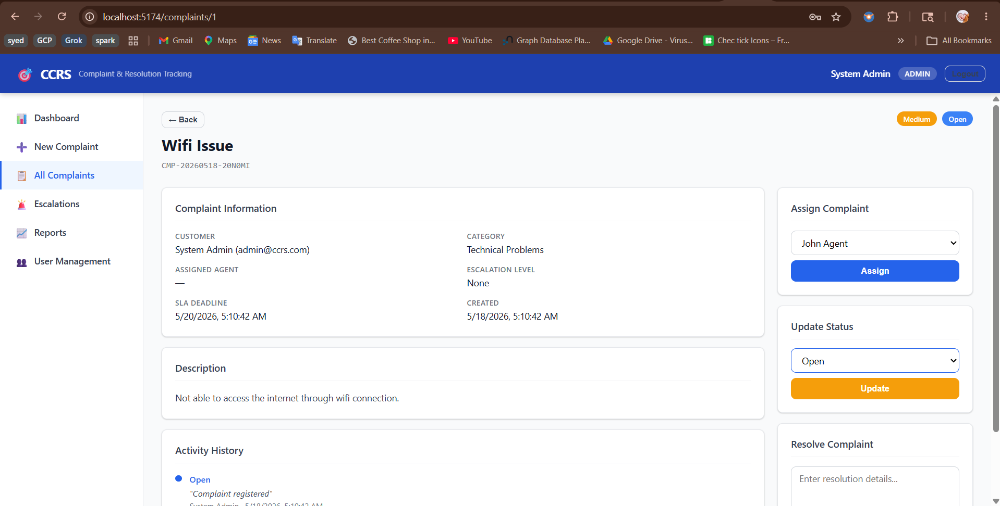
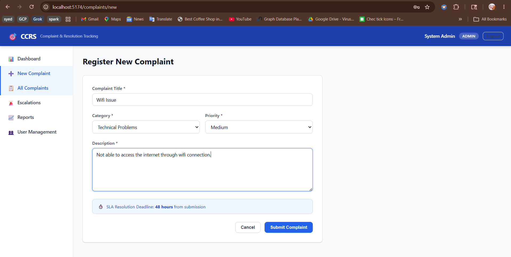
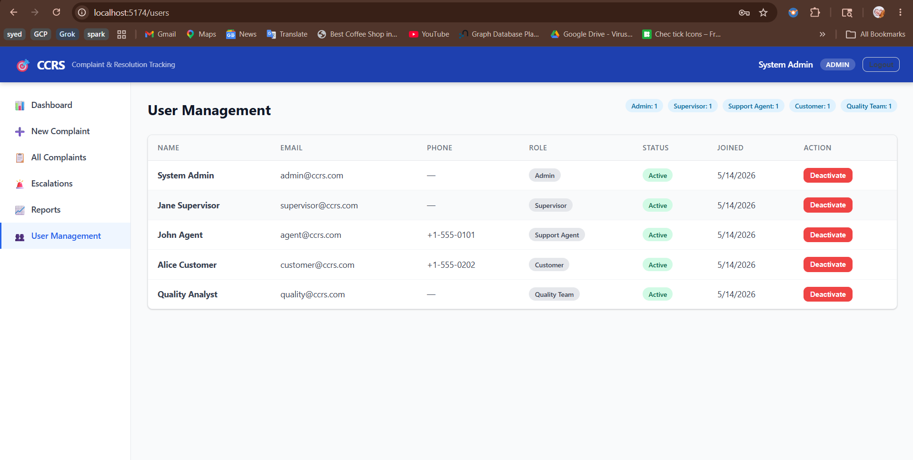

# Customer Complaint & Resolution Tracking System (CCRS)

A full-stack web application for managing customer complaints end-to-end — from registration through resolution — with role-based access control, SLA tracking, escalation management, and analytics reporting.

## Screenshots

| Dashboard | All Complaints |
|-----------|---------------|
|  |  |

| New Complaint Registration | Admin User Management |
|---------------------------|----------------------|
|  |  |

## Tech Stack

| Layer | Technology |
|-------|-----------|
| Frontend | React 18 + React Router 6 + Recharts + Axios |
| Backend | Python 3.12 + FastAPI + SQLAlchemy 2 |
| Database | SQLite (dev) / PostgreSQL (prod via Docker) |
| Auth | JWT (python-jose + bcrypt) |
| Build | Vite 5 |
| Infra | Docker + Docker Compose |

## Project Structure

```
CustomerComplaintAndRTS/
├── backend/
│   ├── app/
│   │   ├── models/          # SQLAlchemy ORM models
│   │   ├── routers/         # FastAPI route handlers
│   │   ├── schemas/         # Pydantic request/response schemas
│   │   ├── services/        # Business logic (auth, complaints, SLA)
│   │   ├── utils/           # Auth utilities
│   │   ├── main.py          # App entry point, CORS, router registration
│   │   ├── database.py      # DB engine & session
│   │   └── config.py        # Environment config
│   ├── seed_data.py         # Database seeder
│   ├── requirements.txt
│   ├── Dockerfile
│   └── .env.example
├── frontend/
│   └── src/
│       ├── pages/           # Route-level page components
│       ├── components/      # Shared UI components (Layout, Navbar, Sidebar)
│       ├── context/         # AuthContext (global auth state)
│       ├── services/        # Axios API client
│       └── App.jsx          # Routes + role-based access config
└── docker-compose.yml
```

## Getting Started

### Option 1 — Docker (recommended)

```bash
docker-compose up --build
```

- Frontend: http://localhost:5173
- Backend API: http://localhost:8000
- API docs: http://localhost:8000/docs

### Option 2 — Local Development

**Backend**

```bash
cd backend
python -m venv venv
venv\Scripts\activate        # Windows
# source venv/bin/activate   # macOS/Linux
pip install -r requirements.txt
cp .env.example .env
uvicorn app.main:app --reload
```

**Frontend**

```bash
cd frontend
npm install
npm run dev
```

**Seed the database**

```bash
cd backend
python seed_data.py
```

## Environment Variables

Copy `backend/.env.example` to `backend/.env` and set values:

```env
DATABASE_URL=sqlite:///./complaint_db.sqlite3
SECRET_KEY=your-super-secret-key-change-in-production
ALGORITHM=HS256
ACCESS_TOKEN_EXPIRE_MINUTES=60
```

## Demo Accounts

| Role | Email | Password |
|------|-------|----------|
| Admin | admin@ccrs.com | Admin@123 |
| Supervisor | supervisor@ccrs.com | Supervisor@123 |
| Support Agent | agent@ccrs.com | Agent@123 |
| Customer | customer@ccrs.com | Customer@123 |
| Quality Team | quality@ccrs.com | Quality@123 |

## Features by Role

| Feature | Customer | Agent | Supervisor | Admin | Quality |
|---------|----------|-------|------------|-------|---------|
| Register / track complaints | Yes | — | — | — | — |
| Agent work queue | — | Yes | — | — | — |
| Escalation dashboard | — | — | Yes | Yes | — |
| User management | — | — | — | Yes | — |
| Reports & analytics | — | — | Yes | Yes | Yes |

## API Overview

| Router | Prefix | Description |
|--------|--------|-------------|
| auth | `/auth` | Login, token refresh |
| users | `/users` | User CRUD, role assignment |
| complaints | `/complaints` | Complaint lifecycle management |
| categories | `/categories` | Complaint category management |
| feedback | `/feedback` | Post-resolution customer feedback |
| dashboard | `/dashboard` | Metrics and summary stats |

Full interactive docs available at `/docs` (Swagger UI) and `/redoc` when the backend is running.
