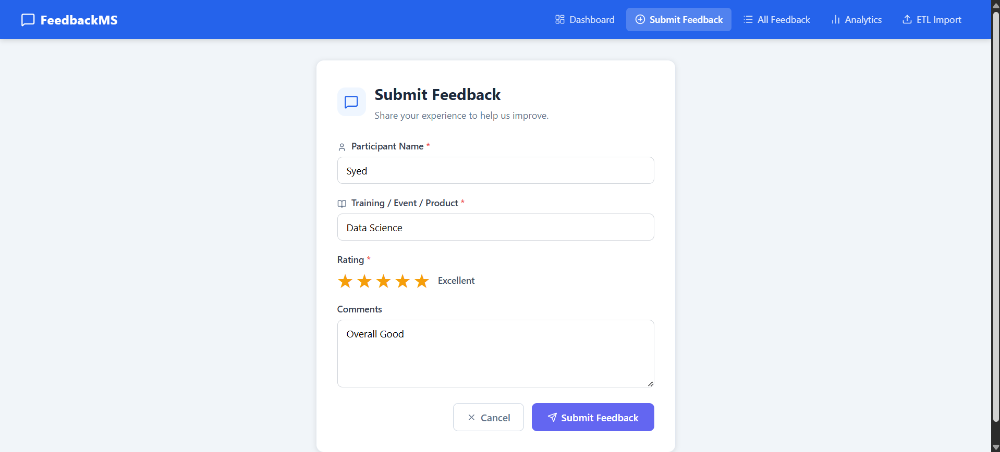
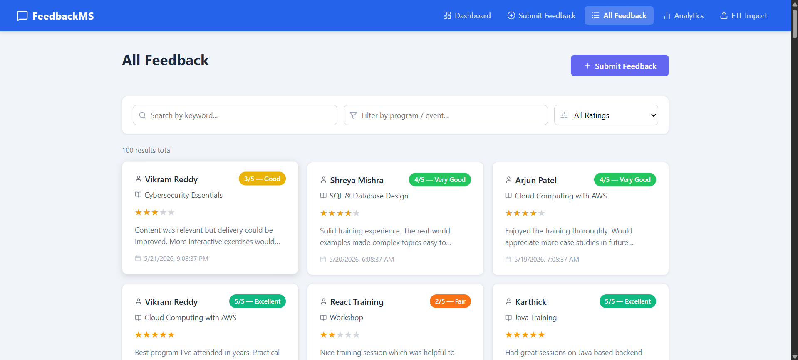
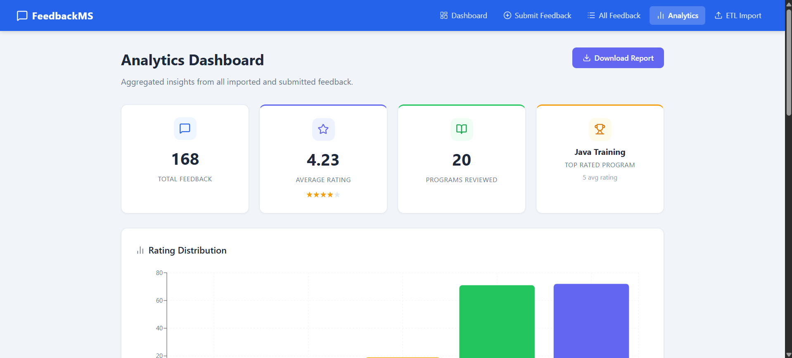
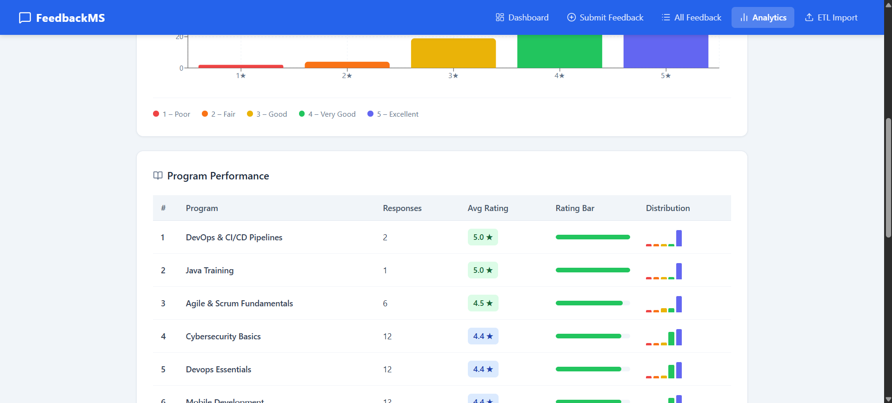
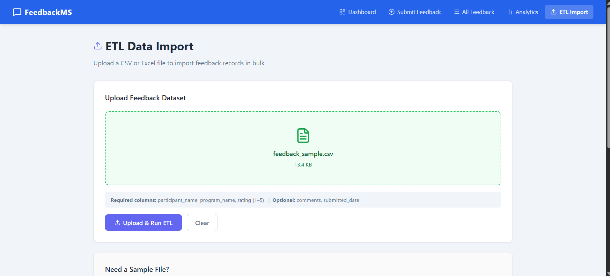
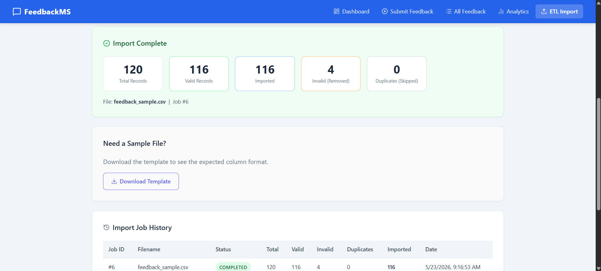

# Feedback Management System

A full-stack web application for centralised training feedback collection, management, bulk data import, and analytics reporting.

---

## Screenshots

**Dashboard** — Central hub showing live stats (total feedback, average rating, excellent and needs-attention counts) alongside the five most recent feedback cards.


**Submit Feedback** — Clean form for participants to submit their name, training/event, a 1–5 star rating, and optional comments.


**All Feedback** — Full paginated list with real-time search by keyword, filter by program name, and filter by star rating.


**Analytics — Summary & Rating Distribution** — Aggregated KPIs (total feedback, average rating, programs reviewed, top-rated program) paired with a colour-coded bar chart of rating distribution.


**Analytics — Program Performance Table** — Ranked table showing each program's response count, average rating badge, visual progress bar, and mini rating-distribution sparkbars.


**ETL Import — File Upload** — Drag-and-drop zone that accepts CSV or Excel files; shows file name and size once selected before triggering the ETL pipeline.


**ETL Import — Results & Job History** — Post-import summary card with record counts (total, valid, imported, invalid, duplicates) and a full history table of all past import jobs.


---

## Project Overview

### Phase 1 — Core Feedback System
Built the foundational CRUD application that allows participants to submit feedback for any training or event, and enables administrators to view, search, edit, and delete entries through a responsive React UI backed by a FastAPI REST API.

### Phase 2 — Analytics, ETL Pipeline & UI Enhancements
Extended the platform with a full ETL data-import pipeline (CSV / Excel), an analytics dashboard with interactive charts and program-level performance tables, a CSV report download, professional Lucide icons throughout the UI, and an automated seed system that pre-populates realistic data on a fresh start.

---

## Tech Stack

| Layer | Phase 1 | Phase 2 Additions |
|-------|---------|-------------------|
| Frontend Framework | React 18, React Router v6 | — |
| HTTP Client | Axios | — |
| Charts | — | Recharts |
| Icons | — | Lucide React |
| Backend | Python FastAPI | — |
| ORM | SQLAlchemy 2.x | — |
| Data Processing | — | Pandas, openpyxl |
| Database | SQLite | ETLJob table added |
| API Docs | Swagger UI (`/docs`) | — |

---

## Project Structure

```
Feedback-Management-System/
├── backend/
│   ├── main.py                  # FastAPI app, CORS, startup seed hook
│   ├── database.py              # SQLite engine & session factory
│   ├── models.py                # SQLAlchemy ORM — Feedback & ETLJob tables
│   ├── schemas.py               # Pydantic request / response schemas
│   ├── crud.py                  # Feedback CRUD operations
│   ├── seed.py                  # Startup seed — populates demo data if DB is empty
│   ├── requirements.txt
│   ├── routers/
│   │   ├── feedback.py          # Feedback CRUD + search endpoints
│   │   └── etl.py               # ETL upload, job history, analytics & report endpoints
│   └── services/
│       └── etl_service.py       # ETL pipeline — read, normalise, validate, transform, load
│
└── frontend/
    ├── public/
    │   └── index.html
    └── src/
        ├── api.js               # Axios base config (base URL)
        ├── App.js               # React Router — 5 page routes
        ├── components/
        │   ├── Navbar.jsx        # Sticky nav with icons and mobile hamburger
        │   └── FeedbackCard.jsx  # Reusable card — name, program, stars, comments, date
        ├── pages/
        │   ├── Dashboard.jsx     # Stats grid + recent feedback (Phase 1)
        │   ├── SubmitFeedback.jsx# Validated submission form (Phase 1)
        │   ├── FeedbackList.jsx  # Search, filter and browse all feedback (Phase 1)
        │   ├── FeedbackDetail.jsx# View, inline-edit and delete a single record (Phase 1)
        │   ├── Analytics.jsx     # KPI cards, bar chart, program table (Phase 2)
        │   └── ETLImport.jsx     # Drag-and-drop bulk upload + job history (Phase 2)
        └── services/
            └── feedbackService.js# All API call helpers — feedback, ETL, analytics
```

---

## Setup & Installation

### Prerequisites
- Python 3.10+
- Node.js 18+

### Backend

```bash
cd backend
pip install -r requirements.txt
uvicorn main:app --reload --port 8000
```

- API base URL: `http://localhost:8000`
- Interactive API docs (Swagger): `http://localhost:8000/docs`
- On first startup the database is created automatically and seeded with 50 demo feedback records across 8 training programs.

### Frontend

```bash
cd frontend
npm install
npm start
```

- App URL: `http://localhost:3000`

---

## API Reference

### Phase 1 — Feedback CRUD & Search

| Method | Endpoint | Description |
|--------|----------|-------------|
| GET | `/api/feedback` | Get all feedback (supports `skip` & `limit`) |
| GET | `/api/feedback/{id}` | Get a single feedback record by ID |
| POST | `/api/feedback` | Submit new feedback |
| PUT | `/api/feedback/{id}` | Update an existing feedback record |
| DELETE | `/api/feedback/{id}` | Delete a feedback record |
| GET | `/api/search` | Search and filter feedback |

**Search query parameters**

| Parameter | Type | Description |
|-----------|------|-------------|
| `keyword` | string | Searches participant name, program name, and comments |
| `rating` | integer (1–5) | Filter by exact rating |
| `program_name` | string | Filter by program / event name (partial match) |

---

### Phase 2 — ETL, Analytics & Reports

| Method | Endpoint | Description |
|--------|----------|-------------|
| POST | `/api/etl/upload` | Upload a CSV / Excel file and run the ETL pipeline |
| GET | `/api/etl/jobs` | List all past ETL import jobs |
| GET | `/api/etl/jobs/{job_id}` | Get details of a specific ETL job |
| GET | `/api/analytics/summary` | Aggregated KPIs — totals, averages, top program |
| GET | `/api/analytics/programs` | Per-program stats ranked by average rating |
| GET | `/api/reports/download` | Download all feedback as a CSV report |

**ETL Upload — accepted file formats:** `.csv`, `.xlsx`, `.xls`

**Required columns in upload file**

| Column | Required | Notes |
|--------|----------|-------|
| `participant_name` | Yes | Also accepts aliases: `name`, `participant` |
| `program_name` | Yes | Also accepts aliases: `program`, `event`, `course` |
| `rating` | Yes | Integer 1–5; also accepts aliases: `score`, `stars` |
| `comments` | No | Also accepts aliases: `comment`, `feedback`, `review` |
| `submitted_date` | No | Also accepts aliases: `date`, `created_at`; defaults to upload time |

---

## Database Schema

### `feedback` table

| Column | Type | Notes |
|--------|------|-------|
| `feedback_id` | INTEGER | Primary key, auto-increment |
| `participant_name` | VARCHAR(100) | Not null |
| `program_name` | VARCHAR(200) | Not null |
| `rating` | INTEGER | 1–5, not null |
| `comments` | TEXT | Optional |
| `submitted_at` | DATETIME | Auto-set to current UTC time on insert |

### `etl_jobs` table *(Phase 2)*

| Column | Type | Notes |
|--------|------|-------|
| `job_id` | INTEGER | Primary key, auto-increment |
| `filename` | VARCHAR(255) | Uploaded file name |
| `status` | VARCHAR(50) | `running` → `completed` or `failed` |
| `total_records` | INTEGER | Rows in the file |
| `valid_records` | INTEGER | Rows that passed validation |
| `invalid_records` | INTEGER | Rows removed (bad rating, missing fields) |
| `duplicate_records` | INTEGER | Rows skipped as duplicates |
| `imported_records` | INTEGER | Rows successfully written to the database |
| `error_message` | TEXT | Populated on failure |
| `created_at` | DATETIME | Job start time |
| `completed_at` | DATETIME | Job end time |

---

## ETL Pipeline — How It Works

1. **Extract** — Reads `.csv` or `.xlsx` / `.xls` files using Pandas.
2. **Normalise** — Strips whitespace, lowercases column headers, and resolves column aliases to canonical names.
3. **Validate** — Rejects rows missing required columns or with ratings outside the 1–5 range.
4. **Transform** — Title-cases names, coerces ratings to integers, drops in-file duplicates, and fills missing dates.
5. **Load** — Bulk-inserts valid records into the `feedback` table and writes a job record to `etl_jobs` with full counts.

---

## Seed Data

On every fresh start (fewer than 5 records in the database) the backend automatically seeds:

- **50 feedback entries** spread across 8 training programs over the past 90 days.
- **30 realistic participant names** with varied ratings (weighted towards 4–5 stars) and authentic comments.
- **3 historical ETL job records** to demonstrate the import history view.

This seed runs once — once 5 or more records exist it is skipped, so real data is never overwritten.

---

## Features

### Phase 1
- Submit feedback with participant name, training / event name, 1–5 star rating, and optional comments
- Dashboard showing total count, average rating, excellent count, needs-attention count, and the 5 most recent entries
- Browse all feedback in a responsive card grid with live keyword search, program filter, and star rating filter
- Full detail view for each feedback record with inline editing and a delete confirmation modal
- Responsive layout — works on desktop and mobile

### Phase 2
- ETL bulk import — drag-and-drop CSV or Excel upload with column alias resolution, validation, deduplication, and per-job result reporting
- Analytics Dashboard — KPI summary cards, a colour-coded rating distribution bar chart (Recharts), and a ranked program performance table with progress bars and mini sparkbars
- CSV report download from the Analytics page (filterable by program and rating)
- Professional Lucide React icons across all pages — navbar, form labels, buttons, stat cards, and section headers
- Automated demo seed data pre-loaded on first startup so the application looks populated from day one
